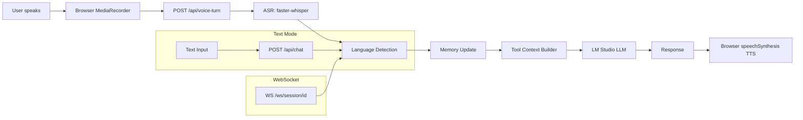

# Architecture

## Pipeline Diagram



## Components

### ASR Service (`asr_service.py`)
Loads `faster-whisper` model on first call. Saves audio to temp file, transcribes, cleans up. Returns `(transcript, language, confidence)`. Graceful fallback if not installed.

### Language Service (`language_service.py`)
Rule-based keyword matching across Spanish, Hindi/Hinglish, and English keyword sets. Returns `(code, label, confidence)`. Falls back to `langdetect` library for ambiguous cases.

### Memory Service (`memory_service.py`)
In-process session store (`dict[str, SessionMemory]`). Each session holds: current/previous language, turn count, structured entities, and full conversation history. Updates atomically per turn.

### Scenario Tools (`scenario_tools.py`)
Deterministic mock tools: `lookup_order`, `search_hotels`, `get_weather`, `pizza_order_context`. Also performs rule-based entity extraction from raw text.

### LLM Service (`llm_service.py`)
Calls LM Studio via `httpx` using the OpenAI-compatible `/chat/completions` endpoint. Injects system prompt with language instructions + structured memory + tool context. Offline fallback templates for each language/scenario.

### Storage Service (`storage_service.py`)
Writes to Supabase if env vars are set, else to local JSON files in `.local_data/`. Stores: messages, language switch events, latency logs.

### WebSocket (`websocket.py`)
Full pipeline over WebSocket. Sends stage events: `language_detected`, `updating_memory`, `calling_llm`, `response_ready`.

## Request Lifecycle

1. Client sends text or audio
2. ASR (if audio)
3. Language detection
4. Memory update + entity extraction
5. Tool context built from entities
6. LLM called with system prompt + memory + tool context + chat history
7. Response returned with language, latency, memory snapshot
8. Frontend speaks response via browser TTS

## Memory Lifecycle

```
Session created → entities = {}
Turn 1 (EN): extract order_id=4421 → store
Turn 2 (EN): extract email=rahul@example.com → store
Turn 3 (HI): language_switch recorded, entities preserved
Turn 4 (HI): refund question answered using stored order_id
Turn 5 (EN): language_switch back, email+order_id still available
```

## Failure Handling

| Failure | Behavior |
|---|---|
| LM Studio offline | Deterministic fallback response, warning shown |
| faster-whisper not installed | 503 error with install instructions, text mode unaffected |
| Supabase unavailable | Falls back to local JSON storage |
| Unknown language | Defaults to English |
